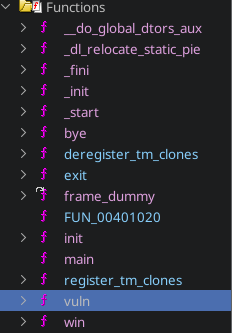

# Write-up
## Recon
In this challenge I was given a single unstripped binary. The results of `file` and `pwn checksec` are below:

File:
```
chall: ELF 64-bit LSB executable, x86-64, version 1 (SYSV), dynamically linked, interpreter /lib64/ld-linux-x86-64.so.2, BuildID[sha1]=f041a6eba0e7557961bb783a363f0cb0bbb3eb8b, for GNU/Linux 3.2.0, not stripped
```

Pwn Checksec:
```javascript
    Arch:     amd64-64-little
    RELRO:    Partial RELRO
    Stack:    Canary found
    NX:       NX enabled
    PIE:      No PIE (0x400000)
```

From this I saw that I was working with an unstripped x86-64 bit binary with NX and a Stack Canary but it is not PIE (Position Independent Executable), this should make reversing and exploit crafting relatively simple.

## Reversing
Next to reverse the binary and see what primitives we are dealing with.

### Static Analysis
For static analysis, my go-to tool is ghidra. So I load it into ghidra and look at the functions it finds. 



From this I can see that there are 5 user defined functions, `main()`, `init()`, `vuln()`, `bye()`, and `win()`. These functions are decompiled as follows (some changes have been made for correctness and readability):

**main():**

```C
int main(void)

{
  init();
  vuln();
  return 0;
}
```

**init():**

```C
void init(void)

{ 
  syscall();
  setvbuf(stdout,(char *)0x0,2,0);
  setvbuf(stdin,(char *)0x0,2,0);
  setvbuf(stderr,(char *)0x0,2,0);
  return;
}
```

**vuln():**

```C
void vuln(void)

{
  long in_FS_OFFSET;
  undefined8 uStack_58;
  byte local_4c [4];
  uint local_48;
  uint local_44;
  undefined8 local_40;
  char local_38 [40];
  long local_10;
  
  local_10 = *(long *)(in_FS_OFFSET + 0x28);
  local_40 = 0;
  puts("which stack position do you want to use?");
  __isoc99_scanf("%d",&local_44);
  local_44 = local_44 << 3;
  local_40 = *(undefined8 *)((long)&uStack_58 + (ulong)local_44);
  puts("you have one chance to modify a byte by xor.");
  puts("Byte Index?");
  __isoc99_scanf("%d",&local_48);
  if (((int)local_48 < 0) || (7 < (int)local_48)) {
    puts("don\'t cheat!");
    exit(0);
  }
  puts("xor with?");
  __isoc99_scanf("%d",local_4c);
  local_38[(ulong)local_48 - 8] = local_38[(ulong)local_48 - 8] ^ local_4c[0];
  puts("finally, do you have any feedback? it will surely help us improve our service.");
  __isoc99_scanf("%20[^@]",local_38);
  printf(local_38);
  bye();
  if (local_10 != *(long *)(in_FS_OFFSET + 0x28)) {
                    /* WARNING: Subroutine does not return */
    __stack_chk_fail();
  }
  return;
}
```
**bye():**

```C
void bye(void)

{  
  puts("Thanks for modifying the byte, goodbye.");
  exit(0);
}
```

**win():**

```C
void win(void)

{
  FILE *__stream;
  long in_FS_OFFSET;
  char local_48 [56];
  long local_10;
  
  local_10 = *(long *)(in_FS_OFFSET + 0x28);
  __stream = fopen("flag.txt","r");
  if (__stream == (FILE *)0x0) {
    puts("flag.txt not found!");
    exit(0);
  }
  fgets(local_48,0x32,__stream);
  puts(local_48);
  puts("How could you do that?!");
  puts("That\'s my precious secret.");
  puts("Anyway congratulations");
  if (local_10 != *(long *)(in_FS_OFFSET + 0x28)) {
                    /* WARNING: Subroutine does not return */
    __stack_chk_fail();
  }
  return;
}
```

From this decomilation we can see that `main()` calls `init()` which sets up the buffer modes for `stdin`, `stdout`, and `stderr`, this is not very important for our purposes. Then main calls `vuln()`, which allows us to grab 8 bytes from the stack, modify a byte, and leave a message. After this the `bye()` funciton is called which prints a message and exits the program.

## The Vulnerability

In this section I will explain the basics of a format string vulnerability. If you already have a good grasp of this, move on to the next section.

The main vulnerability in this program exists within the aptly named `vuln()` function. The call `printf(local_38);` passes a user controlled buffer (`local_38`) directly to `printf()`. This is known as a format string vulnerability. If you have learned C, you probably know that `printf()` can be used to format strings and print non-ascii data as ascii data using format specifiers, for example `printf("Printing a number: %d\n", number);` will print the integer `number` at the format specifier `%d`.  An interesting thing to note is that `printf()` can take a variable number of arguments for instance, all three of these calls are valid: `printf("Hello World!");`, `printf("Number: %d", number);`, and `printf("integer: %d, float: %f, character: %c", integer, float_num, character);`. At compile time you can tell how many arguments `printf()` is supposed to be passed, but how does the process know at runtime? The answer is that it doesn't. At runtime, `printf()` will process the string it is passed, and whenever it encounters a valid format specifier starting with `%`, it will grab the memory from where it expects arguments to be stored and attempt to use it. Generally this should never be a problem, since I should define the string and the arguments in my source code. However, when `printf()` is passed a user controlled buffer directly, the user can place format specifiers in that string, and then `printf()` will grab memory from where it expects arguments to be stored and attempt to use it. The simplest way to use this vulnerability is just to leak information from the stack. Using a format string like `"%p%p%p%p%p%p%p%p"` will print the first 8 arguments as pointers. This can be used in an attempt to leak stack addresses, break PIE by leaking an address from a section of the ELF, or break ASLR by leaking a libc address. However, in this challenge we are not given a libc, so most likely we will not need to leak a libc address, and there is no PIE so we will probably not need to leak an address from the loaded ELF. It is possible that we will need to leak a stack address, however for a stack leak to be useful, we will also need a write primitive in most cases, which brings us to the next, more advanced used of format string vulnerabilities. There is a format specifier used by `printf()` that is not commonly used but is incredibly useful in format string exploitation, the `%n` specifier. This specifier consumes an address as an argument and writes the number of bytes printed by `printf()` to that address. This gives us a write primitive. Now back to the challenge.

## Dynamic Analysis
Now that the vulnerability is known. The next step is to view the memory space of the process (specifically the stack) and how it changes as the program executes so I can find out how to leverage it in my exploit. To do this I generally us GEF which is a useful wrapper for GDB.

```perl
gef➤  tel $rsp
0x00007fffffff0240│+0x0000: 0x0000000000000000   ← $rsp
0x00007fffffff0248│+0x0008: 0x00007ffff7e4d51d  →  <__GI__IO_file_setbuf+000d> test rax, rax
0x00007fffffff0250│+0x0010: 0x00007ffff7faf4e0  →  0x00000000fbad2087
0x00007fffffff0258│+0x0018: 0x0000000000000000
0x00007fffffff0260│+0x0020: 0x00007fffffff03b8  →  0x00007fffffff0a6a  →  "/home/fidesvita/CTF/cyberspace/2024/byte-mod-servi[...]"
0x00007fffffff0268│+0x0028: 0x00007fffffff0290  →  0x00007fffffff02a0  →  0x0000000000000001
0x00007fffffff0270│+0x0030: 0x0000000000000000
0x00007fffffff0278│+0x0038: 0x00007fffffff03c8  →  0x00007fffffff0aa5  →  "SHELL=/run/current-system/sw/bin/bash"
0x00007fffffff0280│+0x0040: 0x00007ffff7ffd000  →  0x00007ffff7ffe2e0  →  0x0000000000000000
0x00007fffffff0288│+0x0048: 0x4cc1af39a008ca00
gef➤  
0x00007fffffff0290│+0x0050: 0x00007fffffff02a0  →  0x0000000000000001    ← $rbp
0x00007fffffff0298│+0x0058: 0x00000000004014fa  →  <main+001c> mov eax, 0x0
0x00007fffffff02a0│+0x0060: 0x0000000000000001
0x00007fffffff02a8│+0x0068: 0x00007ffff7df014e  →  <__libc_start_call_main+007e> mov edi, eax
0x00007fffffff02b0│+0x0070: 0x00007fffffff03a0  →  0x00007fffffff03a8  →  0x0000000000000000
0x00007fffffff02b8│+0x0078: 0x00000000004014de  →  <main+0000> endbr64 
0x00007fffffff02c0│+0x0080: 0x0000000100400040 ("@"?)
0x00007fffffff02c8│+0x0088: 0x00007fffffff03b8  →  0x00007fffffff0a6a  →  "/home/fidesvita/CTF/cyberspace/2024/byte-mod-servi[...]"
0x00007fffffff02d0│+0x0090: 0x00007fffffff03b8  →  0x00007fffffff0a6a  →  "/home/fidesvita/CTF/cyberspace/2024/byte-mod-servi[...]"
0x00007fffffff02d8│+0x0098: 0xf5ac00555ef4dda9
gef➤  
0x00007fffffff02e0│+0x00a0: 0x0000000000000000
0x00007fffffff02e8│+0x00a8: 0x00007fffffff03c8  →  0x00007fffffff0aa5  →  "SHELL=/run/current-system/sw/bin/bash"
0x00007fffffff02f0│+0x00b0: 0x00007ffff7ffd000  →  0x00007ffff7ffe2e0  →  0x0000000000000000
0x00007fffffff02f8│+0x00b8: 0x0000000000403e18  →  0x00000000004011e0  →  <__do_global_dtors_aux+0000> endbr64 
0x00007fffffff0300│+0x00c0: 0x0a53ffab5b96dda9
0x00007fffffff0308│+0x00c8: 0x0a53efeb5cf2dda9
0x00007fffffff0310│+0x00d0: 0x0000000000000000
0x00007fffffff0318│+0x00d8: 0x0000000000000000
0x00007fffffff0320│+0x00e0: 0x0000000000000000
0x00007fffffff0328│+0x00e8: 0x00007fffffff03b8  →  0x00007fffffff0a6a  →  "/home/fidesvita/CTF/cyberspace/2024/byte-mod-servi[...]"
```


```python
[+] Opening connection to byte-modification-service.challs.csc.tf on port 1337: Done
b'== proof-of-work: disabled ==\nwhich stack position do you want to use?\n'
b'you have one chance to modify a byte by xor.\nByte Index?\n'
b'xor with?\n'
b'finally, do you have any feedback? it will surely help us improve our service.\n'
b"\n                                                                                                                                                                                                                                                      4AAAAAAAACSCTF{y0u_Kn0W_fOrmA7_57r1NG_4nd_C4LL_BYTE5}\nHow could you do that?!\nThat's my precious secret.\nAnyway congratulations\n"
[*] Closed connection to byte-modification-service.challs.csc.tf port 1337
```
